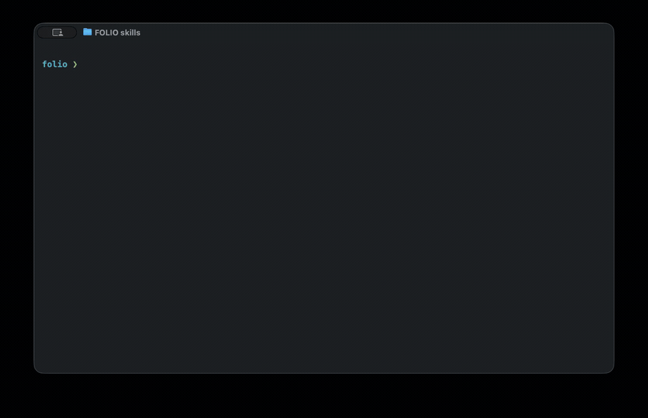

# folio-eureka-ai-dev

This repository contains installable AI agent skills for FOLIO development workflows, plus supporting prompts and documentation.



## 🤖 AI Agent Skills

This repository serves as a skills registry containing guidelines (`SKILL.md`). These skills can be loaded into AI assistants like Cursor, Claude Code, or Copilot using the skills.sh CLI.

### Available skills

- `build-app-context` - Builds or refreshes `references/context/<area>.md` from live TestRail, Jira, and GitHub sources for manual test design.
- `code-review` - Reviews branch diffs and produces a structured code quality report.
- `document-feature` - Documents implemented behavior by analyzing code changes and writing feature docs.
- `ecs-user-setup` - Guides ECS and multi-tenant user setup for FOLIO automated tests.
- `folio-ecosystem` - Bootstraps FOLIO/Eureka platform context, resource lookup, and skill routing for all roles.
- `implement-automated-test` - Generates or updates Cypress E2E tests for FOLIO Stripes.
- `liquibase-migration` - Guides FOLIO Liquibase migration authoring, structure, naming, and database conventions.
- `review-generated-automated-test` - Reviews Cypress E2E test changes against FOLIO Stripes testing conventions.
- `skill-feedback` - Captures user-validated feedback after a skill session and prepares a GitHub-ready report.
- `testrail-bug-report` - Generates Jira-ready bug reports from failed FOLIO TestRail cases.
- `unit-testing` - Applies Java unit testing guidance for JUnit 5, Mockito, strict stubbing, and clear test structure.
- `write-bug` - Drafts reproducible FOLIO bug reports with steps, expected and actual results, and supporting evidence.
- `write-pr-description` - Drafts PR descriptions following team conventions for purpose, approach, and checklist.
- `write-testrail-cases` - Writes structured manual TestRail cases from user stories and application context.
- `write-user-story` - Drafts user stories with scope, requirements, acceptance criteria, and manual testing guidance.

### Installing skills by role

Install only the preset that matches your role:

#### Product Owner

```bash
npx skills add folio-org/folio-eureka-ai-dev \
  --skill folio-ecosystem \
  --skill write-user-story \
  --skill write-bug \
  --skill skill-feedback
```

##### Product Owner via Claude Code plugin (no terminal)

If you use [Claude Code](https://code.claude.com/docs/en/quickstart), install the Product Owner preset as a plugin instead — no terminal or Node.js required. In the Claude Code chat, run:

```
/plugin marketplace add folio-org/folio-eureka-ai-dev
/plugin install folio-po@folio-ai-dev
```

This installs the PO skills together with the official Atlassian Jira MCP server. Full walkthrough: [Product Owner Onboarding: Claude Code + Jira MCP](docs/onboarding/po-claude-code-onboarding.md).

#### Backend Developer

```bash
npx skills add folio-org/folio-eureka-ai-dev \
  --skill folio-ecosystem \
  --skill write-user-story \
  --skill unit-testing \
  --skill liquibase-migration \
  --skill code-review \
  --skill document-feature \
  --skill write-pr-description \
  --skill skill-feedback
```

#### QA Manual

```bash
npx skills add folio-org/folio-eureka-ai-dev \
  --skill folio-ecosystem \
  --skill write-user-story \
  --skill write-testrail-cases \
  --skill build-app-context \
  --skill testrail-bug-report \
  --skill write-bug \
  --skill skill-feedback
```

#### QA Automation

```bash
npx skills add folio-org/folio-eureka-ai-dev \
  --skill folio-ecosystem \
  --skill implement-automated-test \
  --skill review-generated-automated-test \
  --skill ecs-user-setup \
  --skill write-bug \
  --skill skill-feedback
```

### Advanced install

To install every skill in this repository instead of a role preset, run:

```bash
npx skills add folio-org/folio-eureka-ai-dev
```

Run the install command in the target project so your AI assistant picks up the right local skill set and FOLIO guidance.

For more information about skills.sh, see the [official documentation](https://skills.sh/docs).

### Updating skills

To update to the latest version of our team's AI guidelines, run:

```bash
npx skills update folio-org/folio-eureka-ai-dev
```

### GitHub issue reporter

Use the `skill-feedback` skill when you finish working with another skill and want to report what worked well, what was confusing, or what should be improved. It is useful for skill-related bugs, missing guidance, unclear instructions, improvement ideas, requests for additional examples, and proposals for new skills.

Ask your AI agent to run the skill feedback workflow after a skill session. The agent should review the session context, prepare a GitHub-ready issue draft, show the full draft for your approval, and then create an issue in this repository if GitHub access is available. If the agent cannot create the issue directly, copy the approved draft and create the GitHub issue manually.

The feedback loop should stay lightweight: you can create feedback through the `skill-feedback` skill, or simply open a GitHub issue directly in this repository for bugs, ideas, improvements, and new skill proposals. We will continue improving these skills together with the community based on real usage and feedback.

## Prompts and docs

- Document Feature skill: `docs/reference-document-feature-skill.md`
- Unit testing guidelines: `docs/testing/unit-testing.md`
- PR description guide: `docs/pr/pr-description.md`
- Eureka developer flow (platform bring-up, endpoint sequences, tests, per-module watch-outs): `docs/eureka-dev-flow.md`
- Skill engineering guide: `docs/skill-engineering.md`
- Skill test scenarios: `docs/skill-test-scenarios.md`

### Feature documentation

To generate feature documentation after implementing or updating a feature, use this snippet.

```text
Fetch and follow instructions from https://raw.githubusercontent.com/folio-org/folio-eureka-ai-dev/refs/heads/master/docs/reference-document-feature-skill.md
```

### Unit tests

To follow our unit testing guidelines (structure, naming, Mockito usage, verification patterns), use this snippet before starting tests.

```text
Fetch and follow instructions from https://raw.githubusercontent.com/folio-org/folio-eureka-ai-dev/refs/heads/master/docs/testing/unit-testing.md
```

### PR description

To write a consistent, reviewable pull request description following our conventions, use the snippet.

```text
Fetch and follow instructions from https://raw.githubusercontent.com/folio-org/folio-eureka-ai-dev/refs/heads/master/docs/pr/pr-description.md
```
